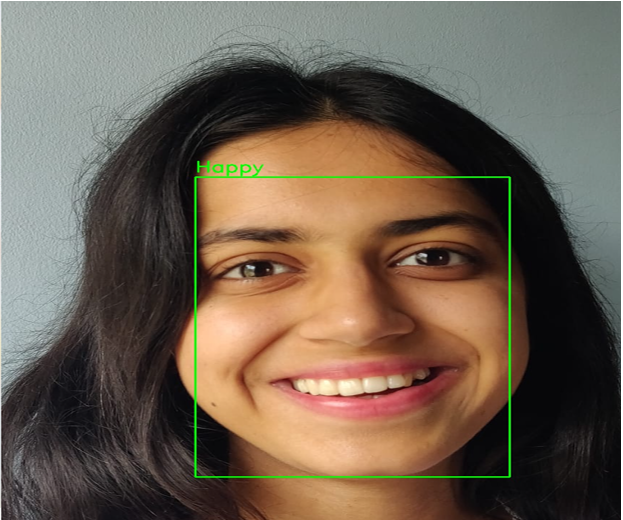
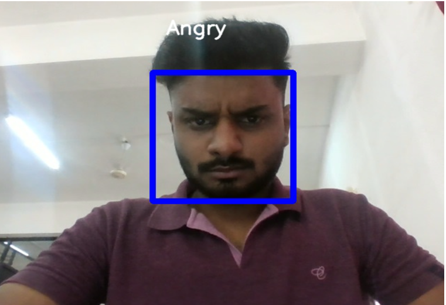

# 😊 Facial Emotion Detection – Real-Time Analysis Using Live Video

A real-time facial emotion detection system that uses computer vision and machine learning to classify human emotions from live video streams. The system processes facial features and identifies expressions such as happiness, sadness, anger, surprise, fear, and more with the help of deep learning models.

---

## 🎯 Objectives

- Build a real-time system to detect emotions from facial expressions.
- Achieve low-latency (sub-100ms) predictions for live video feeds.
- Ensure privacy, consent, and ethical use of facial data.
- Create a user-friendly UI for interaction and emotion display.
- Demonstrate real-world use cases in healthcare, education, marketing, and entertainment.

---

## 📸 Screenshots

| Happy (Live Feed) | Happy (Image Upload) |
|-------------------|----------------------|
|  |  |

| Angry (Live Feed) |
|-------------------|
|  |

---

## 🛠️ Tech Stack

- **Programming Language**: Python
- **Machine Learning**: CNN (TensorFlow, Keras)
- **Computer Vision**: OpenCV, dlib
- **Frontend**: HTML, CSS, JavaScript
- **Backend**: Flask (REST API)
- **IDE/Tools**: Jupyter, VS Code
- **Hardware**: Web Camera, Intel i3/i5 or higher, 8GB+ RAM

---

## ⚙️ How It Works

1. Captures real-time frames via webcam.
2. Uses `dlib` or `OpenCV` to detect facial landmarks.
3. Extracts features and passes them to a trained CNN.
4. CNN outputs probabilities for 7 emotion classes.
5. Displays prediction live on-screen via OpenCV.

---

## 📸 Features

- 🎥 Live video and image upload emotion detection
- 😊 Classifies: Happy, Sad, Angry, Surprise, Neutral, Disgust, Fear
- 🔐 Privacy-aware (no image saving without consent)
- 📊 Emotion dashboard (for aggregated insights)
- 🔄 Responsive GUI
- 🧪 Tested across browsers and systems

---

## 📈 Performance & Testing

- ✅ Passed testing on 8GB RAM, i3/i5 systems
- ❌ Performance lag observed on <6GB systems
- ✅ Accurate classification for varied emotions and lighting
- ❌ Lower accuracy in extreme environments (e.g., poor light)

---

## 🔮 Future Enhancements

- Add voice-based sentiment input (multi-modal)
- Differential privacy integration
- Expand emotion classes
- Support mobile camera feeds
- Deploy using Flask + Docker + Streamlit

---

## 📚 References

- OpenCV, TensorFlow, Dlib
- Research papers cited in Literature Survey
- Emotion Recognition in the Wild (FER2013 Dataset)

---
